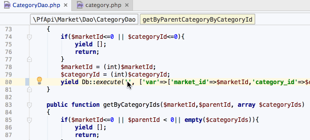
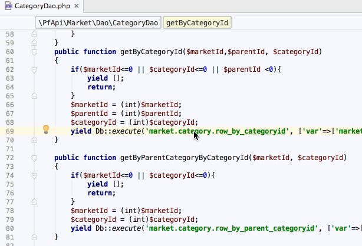
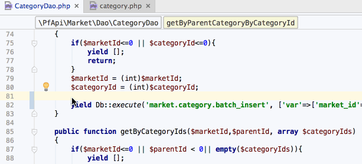

# Zan Plugin Beta

## Install

Preference -> Plugins -> Install plugins from disk... -> 选择ZanPlugin.jar -> restart PhpStorm

## Feature

1. Db::execute("sid参数自动补全"); 
2. Client::call("参数自动补全"); 
3. Db::execute("sid ctrl+mouse 自动跳转到sql文件定义位置")

## TODO

1. sqlmap文件名与table字段不一致情况
2. 检查sid对应sql文件与项是否存在
3. 检测client::call配置是否存在
4. resource/sql 文件夹内sqlmap文件反向查找使用者